# Check Weather

> Check Weather is a web application that enables users all over the world to check the current weather of a perticular city by typing the name of the city and clicking on search.

> The web application by default provides users with a five-day weekly forecast of weather codition, wind speed, maximum and minimum temperatures in the lower section.
This forecast starts right from the current day. Thus, unless a user is looking for a different city's current weather, he or she can easily find the weather in his or her city without a search.
View the live web application [here] (https://samuelandersoncodes.github.io/check-weather/) 

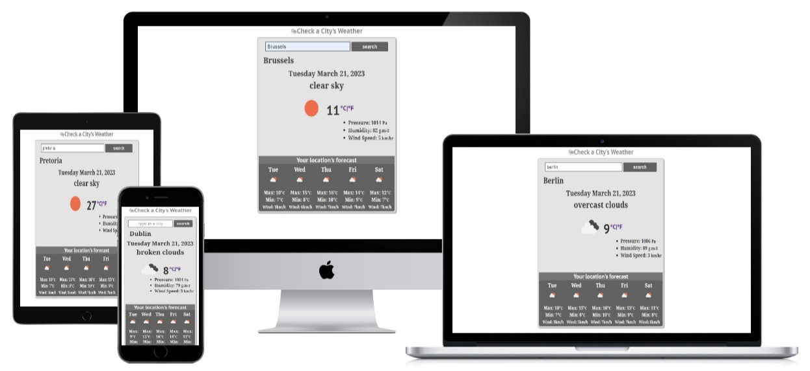

## Features

### Existing Features

* Main heading
    * The web application has a clear responsive heading with an icon on the topmost part.
    * This informs the user about the exact use and interactiveness of the application. Thus, to check for a city's current weather. 

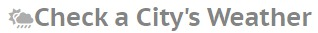   

* Input field
    * The input field of the web application allows users to type in a city they want to search.
    * This field is validated and therefore cannot be submitted empty or with an inappropriate data.
    * It has a placeholder text that further informs the user exactly where and what to type in.
    * It also features a hover effect that tells the user beforehand that they are on the field.

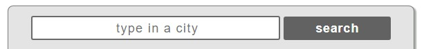

* Search button
    * The web application features a search button that allows users to submit the typed in city in order for them to get the weather of that city displayed.

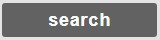

* Current weather display section
    * This section of the application displays the typed in city, the current date and its corresponding weather description, weather description icon, temperature, pressure, humidity, and wind speed.
    * In order not to display emptyness or unreal data, it is by default set to the city of Dublin and will change whenever another city is keyed in.

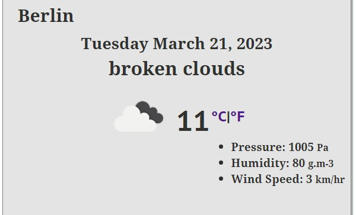

* Temperature unit conversion 
    * This part of the web application allows the user to convert temperature units from the defaut celsius unit to fahrenheit and vice versa just by clicking on the desired unit.
    * This helps the user to save the time of trying to manually convert units.

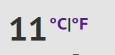

* Weekly weather forecast section
    * This section has a self-explanatory heading that tells the user clearly that the displayed forecast is only the forecast of their current location.
    * This part of the application displays a five-day consistent weekly weather forecast (starting from the current day) based on the location of the user.
    * The forecast consists of the day of the week, its weather description icon, wind speed,maximum and minimum temperature.
    * The weekly forecast uses geolocation and therefore needs the user to grant location access before they can get the feed. Thus, if users location is off, the app will ask for location access permission first. If access is granted, the forecast section displays alongside the current weather section and vice versa.   

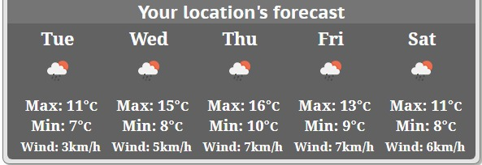

### Features Left to Implement

* As a future enhancement, the city input field will be connected to the weekly weather forecast section so that users can look for other citys' forecast as well. It will be considered to also add two more forecast days adding up to seven instead of just five days.

## Design

### Wireframes
<br>
Desktop version
<br><br>

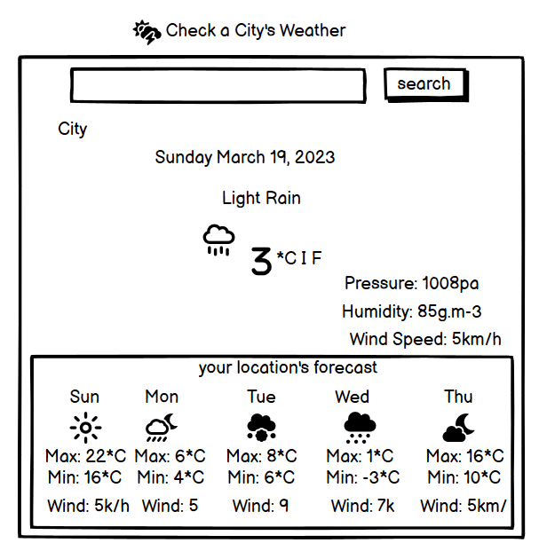

<br><br>
Tablet Version
<br><br>

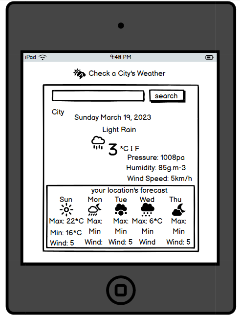

<br><br>
Phone Version
<br><br>

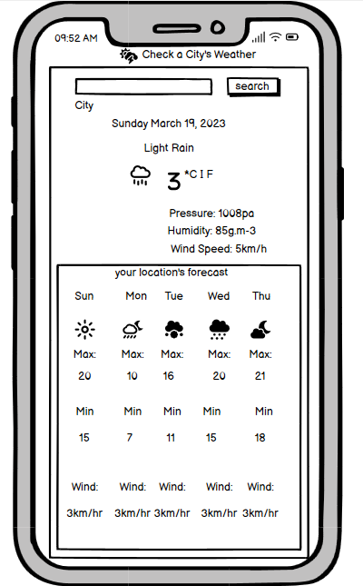

<br><br>
## Testing 

### Responsiveness

The web application was tested to ensure responsiveness on screen sizes of 320px and above as defined in [WCAG 2.1 Reflow criteria for responsive design](https://www.w3.org/WAI/WCAG21/Understanding/reflow.html) on Safari, Chrome, Edge, Firefox and Opera browsers.

Steps to test:

1. Open browser and navigate to [Check Weather](https://samuelandersoncodes.github.io/check-weather/)
2. Open the developer tools by right clicking or tapping the F12 key and click on inspect.
3. Set to responsive and decrease width to 320px
4. Set the zoom to 50%
5. Click and drag the responsive window to maximum width

* Expected;

The web application is responsive on all screen sizes and no icons or elements are pixelated or stretched.
No horizontal scroll is present.
No elements overlap.

* Actual;

The web application works exactly as expected.

The web application was opened on the following devices and no responsive issues were found;

- Huawei mipad 10
- Iphone 10
- Iphone 12 Xs max
- Iphone 12
- Iphone 13
- Iphone 6S plus
- Xiomi Redme 11 pro
- Samsung A 12
- Samsung Galaxy 20
- Samsung Galaxy Tab S7
- Infinix Hot 10
- Infinix Hot 12
- Asus Sonicmaster
- Hp EliteBook 8440p
- Hp laptop 14s

### Accessibility

[Wave Accessibility](https://wave.webaim.org/report#/https://samuelandersoncodes.github.io/check-weather/) tool was used throughout the development process and for the final testing of the deployed web application to test for aid accessibility.

The test was aimed at ensuring the following criteria were met:

- All forms have associated labels or aria-labels so that this is read out on a screen reader to users who tab to form inputs.
- Color contrasts meet a minimum ratio as specified in [WCAG 2.1 Contrast Guidelines](https://www.w3.org/WAI/WCAG21/Understanding/ 
  contrast-minimum.html)
- Heading levels are not missed or skipped to ensure the importance of content is relayed correctly to the end user.
- All content is contained within landmarks to ensure ease of use for assistive technology.
- All non-textual content had alternative text or titles so that descriptions can be read out to screen readers.
- HTML page lang attribute has been set.
- Aria properties have been implemented correctly.
- WCAG 2.1 Coding best practices are well followed.

Manual tests were also performed to ensure the web application is accessible as possible.

### Lighthouse Testing

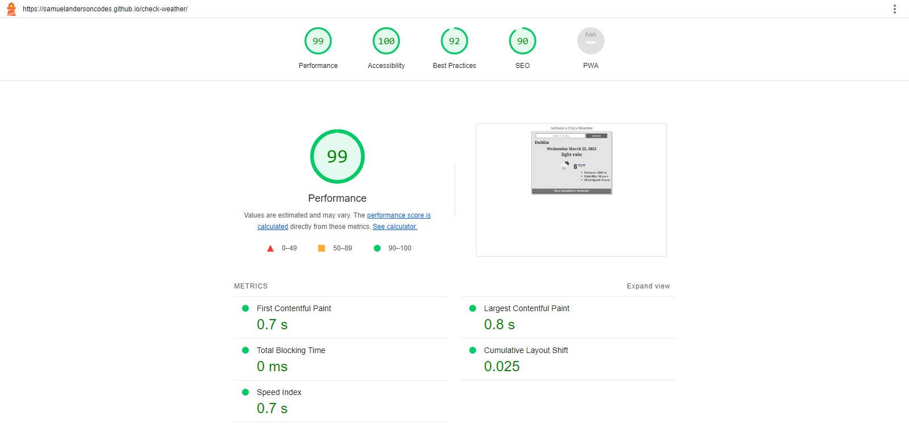

### Functional Testing

**Form Testing**

The form on the web application was tested to ensure it functioned as expected. Both correct data and incorrect data as well as an empty field submission were tested. The following test scenarios were covered:

* Scenario One - Correct Input data;

Steps to test:

1. Navigate to [Check Weather](https://samuelandersoncodes.github.io/check-weather/)
2. Type in a valid city name:
3. Click on the "search" button. 
4. The current weather condition of the particular searched city is fully displayed on the central part of the web application with the corresponding city name.

Expected:

Form submits with no warnings or errors.

Actual:

The web application behaved as expected with no errors or warnings.

* Scenario Two - Submitting an empty Field;

Steps to test:

1. Navigate to [Check Weather](https://samuelandersoncodes.github.io/check-weather/)
2. Leave the input field empty:
3. Click on the "search" button. 
4. There is a (please fill out this field) notification. 

Expected:

The form does not submit but prompts the user to fill out the field.

Actual:

The web application behaved as expected, the error alert message was displayed and the form did not submit.

* Scenario Three - Submitting a non-city name;

Steps to test:

1. Navigate to [Check Weather](https://samuelandersoncodes.github.io/check-weather/)
2. Type in a non-city name like 'food':
3. Click on the "search" button. 
4. The form does not submit. 

Expected:

The form does not submit.

Actual:

The web application behaved as expected, the form did not submit.

**Weekly forecast section**

The weekly forecast section was tested to ensure it functioned as expected. In a scenario where location was allowed and in another scenario where location was blocked were tested. In a case where a user has the browser's location already turned on was also tested. The following test scenarios were covered:

* Scenario One - location was allowed;

Steps to test:

1. Navigate to [Check Weather](https://samuelandersoncodes.github.io/check-weather/)
2. Click on allow on the location pop up.
3. The weekly weather forecast section opens alongside the current weather section. 


Expected:
The weekly weather forecast section opens alongside the current weather section.

Actual:

Behavior was as expected. 

* Scenario Two - location was not allowed;

Steps to test:

* Steps to test the weekly forecast section
1. Navigate to [Check Weather](https://samuelandersoncodes.github.io/check-weather/)
2. Click on 'block' on the location pop up.
3. The weekly weather forecast section does not open alongside the current weather section. 

Expected:
The weekly weather forecast section does not open alongside the current weather section.

Actual:

Behavior was as expected. 

* Scenario Three - location was already on;

Steps to test:

1. Turn on Browser location
2. Navigate to [Check Weather](https://samuelandersoncodes.github.io/check-weather/)
3. The weekly weather forecast section opens automatically alongside the current weather section. 


Expected:

The weekly weather forecast section opens alongside the current weather section automatically without a notification popup.

Actual:

Behavior was as expected. 

**Celsius and Fahrenheit Conversion**

The celsius and fahrenheit units conversion were also tested to ensure it did the right conversion. 

Steps to test:

1. Navigate to [Check Weather](https://samuelandersoncodes.github.io/check-weather/)
2. Click or tap on the fahrenheit link.
3. The unit converts to fahrenheit correctly. 
4. Click or tap the celsius link.
5. The units returns to its default celsius unit.

Expected:

Celsius converts smoothly and correctly into fahrenheit upon a click or tap. Fahrenheit converts back to the default celsius unit upon a click or tap.

Actual:

The web application behaved as expected with no errors or warnings.

### Validator Testing 
* HTML
  - No errors were returned when passing through the official [W3C validator](https://validator.w3.org)


* CSS
  - No errors were returned when passing through the official [Jigsaw validator](https://jigsaw.w3.org/css-validator/)
  
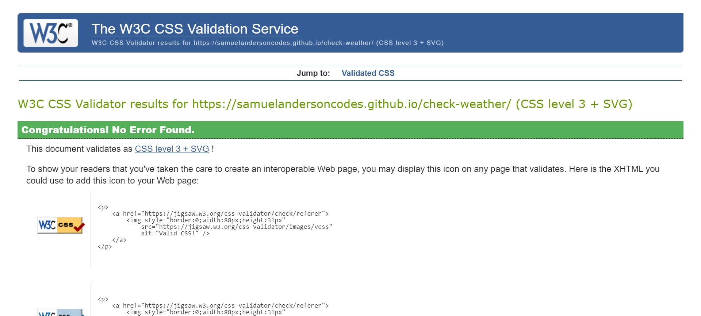

* Javascript
  - No errors were returned when passing through the official [JSHint validator](https://jshint.com/)
  - However, a warning shows that async functions are only available in ES8. This warning persists since JSHint does not feature ECMAScript 8.  
  
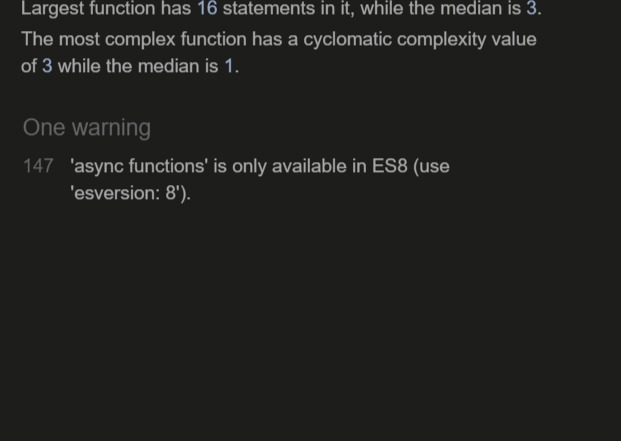

### Unfixed Bugs
Not necessarily a bug but a JSHint warning that is beyond control. The warning states that 'async functions are only available in ES8.' I employ a modern way to fetch data and therefore find it necessary to use the asynchronous function which unfortunately does not feature on the JSHint validator.

## Deployment

### Version Control

The site was created using the Gitpod workspace and pushed to github to the remote repository ‘check-weather’.

The following git commands were used throughout the development to push code to the remote repository:

```git add .``` - This command was used to add the file(s) to the staging area before they are committed.

```git commit -m “commit message”``` - This command was used to commit changes to the local repository queue ready for the final step.

```git push``` - This command was used to push all committed code to the remote repository on github.

```git commit --amend -m "Amended git commit message"``` - This command was used to correct mistakenly/misspelt pushed commit messages.

```git push -f"``` - This command was used to force push an amended commit message.


### Deployment to Github Pages

- This website was deployed to GitHub pages. The steps to deploy are as follows; 
  - In the GitHub repository, navigate to the Settings tab 
  - From the menu on the left select 'Pages'
  - From the source section drop-down menu, select the main branch.
  - Click 'Save'
  - Refresh the page after a moment.
  - A live link will be displayed when published successfully.
  

This is the live link ; https://samuelandersoncodes.github.io/check-weather/ 

## Credits 

* [Code Institute](https://github.com/Code-Institute-Org/gitpod-full-template)
  * I appreciate Code institute's support and their gitpod template.

* [Font Awesome](https://fontawesome.com/icons)
    * Code was used from this website to create the heading icons that come right before the web application's main heading.
    * Styles were changed to suit styling on the Web application.

* [Google Fonts](https://fonts.google.com/)
    * The fonts (PT Sans Caption and Noto Serif) used on this web application were imported from google fonts.

* [Youtube Geolocation Tutorial](https://www.youtube.com/watch?v=JdJ2VBbYYTQ)
    * The geolocation aspect of the application was inspired by this video. 
<br><br>

* Persons
    * A big appreciation to Gareth Mcgirr who inspired and mentored me throughout the project especially for best practices.
    
    * I thank Olena Olkhovyk for inspiring me and giving me the color styling ideas.

### Content 

All the content with the exception of those listed in the Media and credits sections of this document were originaly made by Samuel Anderson.

### Media
  
The weather icons were imported from https://openweathermap.org/ and the icon in front of the main heading is from font awesome. 

 


 